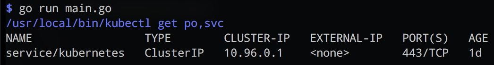

# kubecuddler

[](https://goreportcard.com/report/github.com/mhausenblas/kubecuddler)
[](https://godoc.org/github.com/mhausenblas/kubecuddler)

A simple Go package wrapping `kubectl` invocations. It only depends on the stdlib and overall has a minimal footprint.

First, make sure you've got the package installed, for example, in a global scope:

```shell
$ go get -u github.com/mhausenblas/kubecuddler
```

A minimal usage example would look like the following:

```go
package main

import (
	"fmt"

	"github.com/mhausenblas/kubecuddler"
)

func main() {
	res, _ := kubecuddler.Kubectl(true, true, "", "get", "po,svc")
	fmt.Println(res)
}
```

This produces an output like so:



Another example, this time with a failing command, looks like this:

```go
package main

import (
	"fmt"

	"github.com/mhausenblas/kubecuddler"
)

func main() {
	res, _ := kubecuddler.Kubectl(true, true, "", "get", "depl")
	fmt.Println(res)
}
```

The above produces an output akin to:

